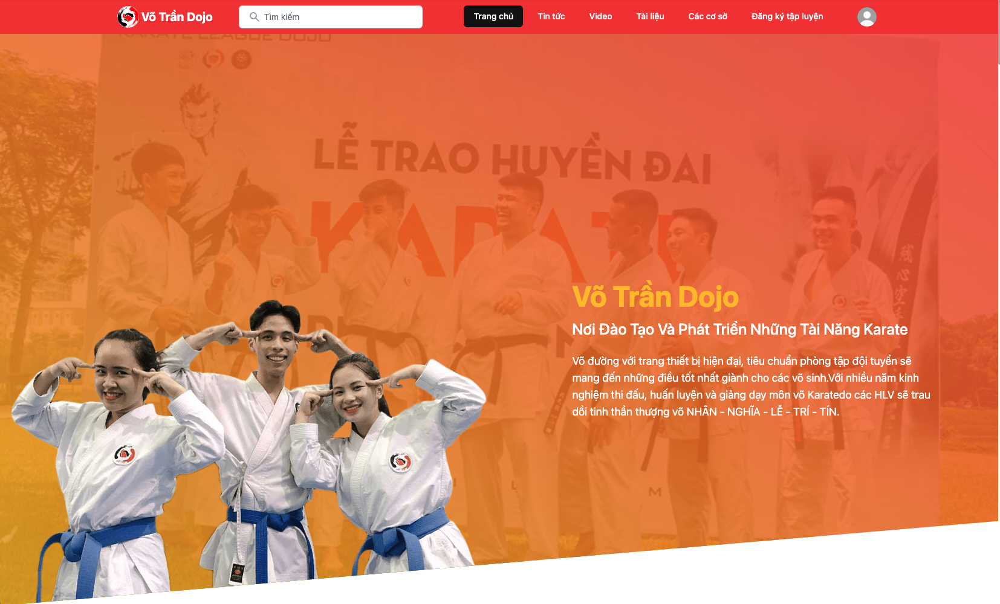
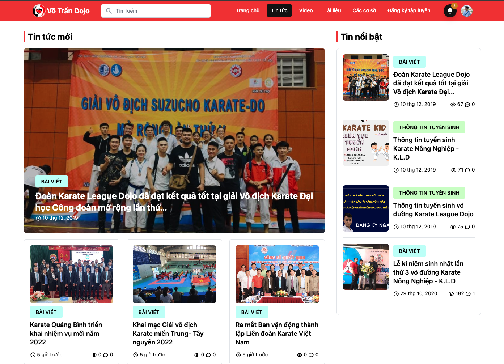
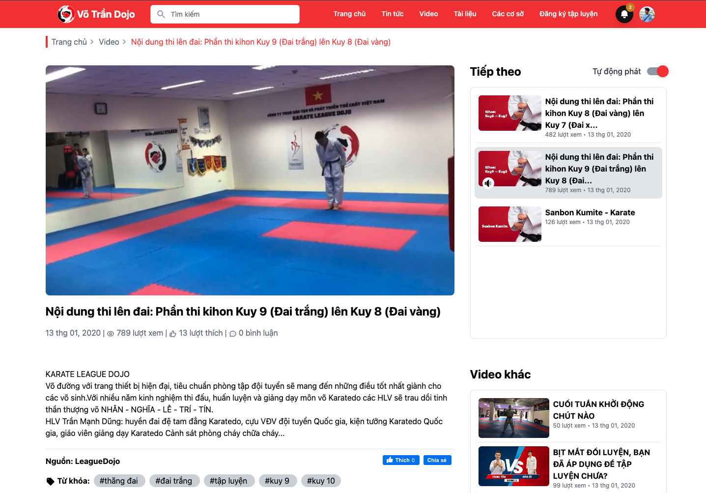
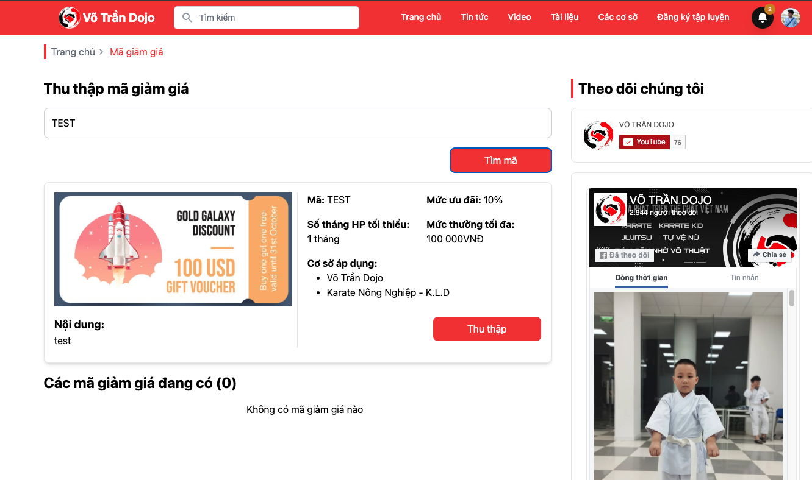
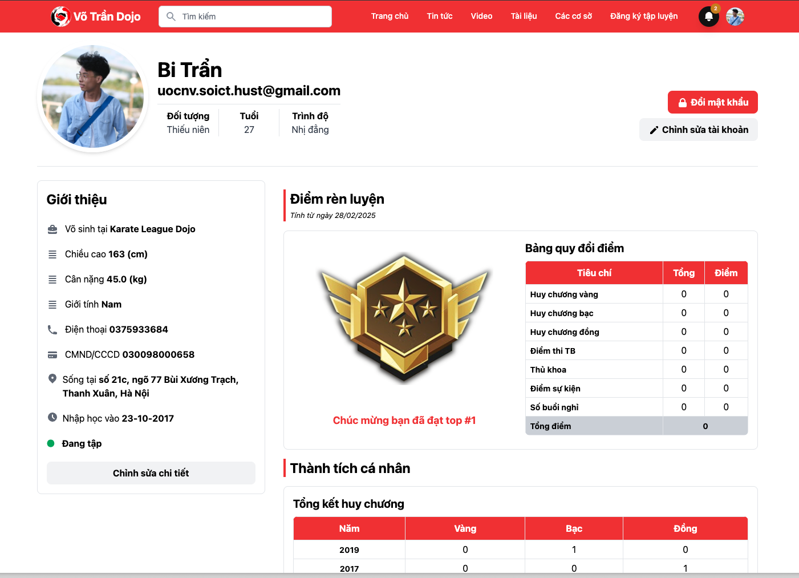

# Karate League Dojo

[](https://laravel.com)
[](https://php.net)
[](LICENSE)

<p align="center">
  
</p>

## 📋 Mô tả dự án

**Karate League Dojo** là một hệ thống quản lý toàn diện cho các võ đường karate tại Hà Nội, được phát triển dưới sự quản lý và giảng dạy trực tiếp của HLV Trần Mạnh Dũng - kiện tướng Karate-do quốc gia.

Hệ thống cung cấp nền tảng kỹ thuật số để:
- Quản lý thông tin võ sinh và lịch tập luyện
- Cung cấp nội dung giáo dục và tin tức võ thuật
- Tích hợp với YouTube để chia sẻ video thi đấu và hướng dẫn
- Hỗ trợ quản lý tài chính và đặt phòng tập
- Theo dõi tiến độ học tập và xếp hạng

## 🎯 Tính năng chính

### 🏠 Giao diện người dùng
- **Trang chủ**: Dashboard tổng quan với thông tin mới nhất
- **Tin tức**: Hệ thống bài viết và thông báo
- **Video**: Tích hợp YouTube với video thi đấu và hướng dẫn
- **Voucher**: Quản lý mã giảm giá và ưu đãi
- **Cá nhân**: Trang quản lý thông tin cá nhân

### 👥 Quản lý võ sinh
- Đăng ký và quản lý thông tin học viên
- Theo dõi tiến độ học tập
- Hệ thống xếp hạng và điểm rèn luyện
- Quản lý học phí và thanh toán

### 🏢 Quản lý võ đường
- Đặt lịch và quản lý phòng tập
- Quản lý lịch giảng dạy
- Hệ thống thông báo và sự kiện
- Quản lý tài liệu võ thuật

### 📊 Hệ thống quản trị
- Giao diện admin toàn diện với Voyager
- Quản lý nội dung và người dùng
- Báo cáo thống kê và phân tích
- Hệ thống log và bảo mật

## 🖼️ Giao diện

### Trang tin tức
<p align="center">
  
</p>

### Trang video
<p align="center">
  
</p>

### Trang voucher
<p align="center">
  
</p>

### Trang cá nhân
<p align="center">
  
</p>

## 🚀 Cài đặt và triển khai

### Yêu cầu hệ thống
- PHP >= 7.4
- Composer
- MySQL >= 5.7
- Node.js & NPM (cho frontend assets)

### Bước 1: Clone repository
```bash
git clone https://github.com/NguyenUoc98/leaguedojo.com.git
cd leaguedojo.com
```

### Bước 2: Cài đặt dependencies
```bash
composer install
npm install
```

### Bước 3: Cấu hình môi trường
```bash
cp .env.example .env
php artisan key:generate
```

### Bước 4: Cấu hình database
Chỉnh sửa file `.env` với thông tin database:
```env
DB_CONNECTION=mysql
DB_HOST=127.0.0.1
DB_PORT=3306
DB_DATABASE=leaguedojo
DB_USERNAME=root
DB_PASSWORD=
```

### Bước 5: Chạy migrations và seeders
```bash
php artisan migrate
php artisan db:seed
php artisan orchid:admin admin admin@admin.com password
```

### Bước 6: Tạo symbolic link cho storage
```bash
php artisan storage:link
```

### Bước 7: Khởi chạy ứng dụng
```bash
php artisan serve
```

Truy cập `http://localhost:8000` để xem ứng dụng.

### Bước 8: Truy cập admin panel
- URL: `http://localhost:8000/admin`
- Email: `admin@admin.com`
- Password: `password`

## 📚 Thư viện và công nghệ

### Backend Framework
- **[Laravel 10.x](https://laravel.com/)**: PHP framework cho web development
- **[Voyager](https://github.com/the-control-group/voyager)**: Admin panel cho Laravel
  - Giao diện quản trị trực quan
  - CRUD operations tự động
  - Quản lý menu và file
  - BREAD system

### Frontend & UI
- **[Bootstrap](https://getbootstrap.com/)**: CSS framework
- **[jQuery](https://jquery.com/)**: JavaScript library
- **[Livewire](https://laravel-livewire.com/)**: Full-stack framework cho Laravel

### Media & Content
- **[YouTube API](https://github.com/alaouy/Youtube)**: Tích hợp YouTube
- **[Eloquent Viewable](https://github.com/cyrildewit/eloquent-viewable)**: Quản lý lượt xem
- **[Comments](https://github.com/laravelista/comments)**: Hệ thống bình luận

### Data Management
- **[Laravel Excel](https://github.com/Maatwebsite/Laravel-Excel)**: Import/Export Excel
- **[Faker YouTube](https://github.com/aalaap/faker-youtube)**: Tạo dữ liệu test

## 🏗️ Cấu trúc dự án

```
leaguedojo.com/
├── app/
│   ├── Actions/          # Business logic actions
│   ├── Console/          # Artisan commands
│   ├── Http/
│   │   ├── Controllers/  # Application controllers
│   │   ├── Livewire/     # Livewire components
│   │   └── Middleware/   # HTTP middleware
│   ├── Models/           # Eloquent models
│   ├── Notifications/    # Notification classes
│   └── Providers/        # Service providers
├── database/
│   ├── migrations/       # Database migrations
│   ├── seeders/         # Database seeders
│   └── factories/       # Model factories
├── resources/
│   ├── views/           # Blade templates
│   ├── js/             # JavaScript assets
│   └── sass/           # SCSS stylesheets
├── routes/              # Application routes
└── public/             # Public assets
```

## 🔧 Cấu hình môi trường

### Biến môi trường quan trọng
```env
APP_NAME="Karate League Dojo"
APP_ENV=production
APP_DEBUG=false
APP_URL=https://your-domain.com

DB_CONNECTION=mysql
DB_HOST=127.0.0.1
DB_PORT=3306
DB_DATABASE=leaguedojo
DB_USERNAME=your_username
DB_PASSWORD=your_password

YOUTUBE_API_KEY=your_youtube_api_key
```


## 🤝 Đóng góp

1. Fork dự án
2. Tạo feature branch (`git checkout -b feature/AmazingFeature`)
3. Commit changes (`git commit -m 'Add some AmazingFeature'`)
4. Push to branch (`git push origin feature/AmazingFeature`)
5. Mở Pull Request

## 👨‍💻 Tác giả

[Nguyễn Văn Ước](https://github.com/NguyenUoc98)

⭐ Nếu dự án này hữu ích, hãy cho chúng tôi một star!
